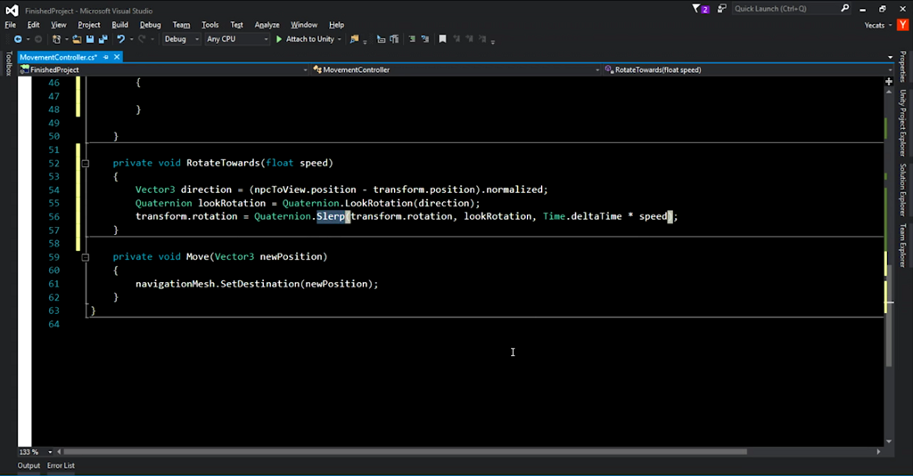

# Inventory and Store System - Part 1

In this episode, we continue our RPG project, starting off by building an item system which will also be used for equipment and merchant functionality. To prepare for the system, we'll go over more Unity fundamentals, like methods of object rotation, filtering, tags and sorting layers.

# Where is the starter project?
This episode is part of a series. You can use the "Finished Project" from the [Basics of Unity](../UnityNavigationPt2) episode as the starting project.

#Challenge
This episodes challenge is to build on the rotation concepts that we went over and apply them to the merchant. When the player starts walking towards the merchant, the merchant should also have their rotation adjusted to face the player. 

# Resources

* [Rotation and Orientation in Unity](https://docs.unity3d.com/Manual/QuaternionAndEulerRotationsInUnity.html)
* [Layers](https://docs.unity3d.com/Manual/Layers.html)
* [Tags and Layers](https://docs.unity3d.com/Manual/class-TagManager.html)
* [Layer-Based Collision Detection](https://docs.unity3d.com/Manual/LayerBasedCollision.html)
* [Sorting Layers](https://unity3d.com/learn/tutorials/topics/2d-game-creation/sorting-layers)

# Credit

This project uses the following assets:

* [Low Poly: Free Pack](https://www.assetstore.unity3d.com/en/#!/content/58821) by AxeyWorks