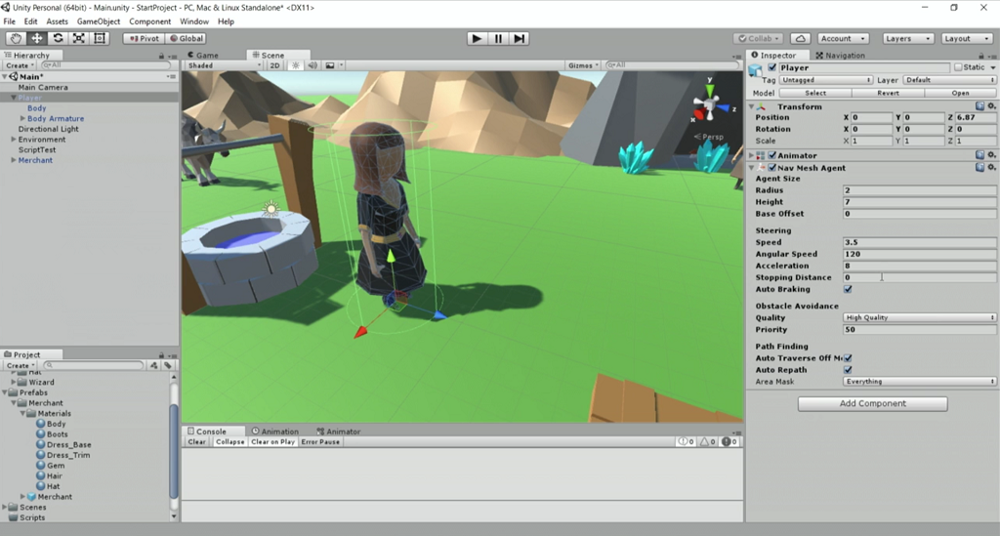

# Unity Navigation - Part 1

In this [episode](https://channel9.msdn.com/Shows/dotGAME/Unity-Navigation-Part-1) we will add point and click style movement to our character using Unity's Navigation System. More specifically, we will go over baking a navigation mesh, setting up the NavMeshAgent and writing code to make our character move to a position when the user clicks on the ground. This video will also introduce the concept of Raycasting.

# Where is the starter project?
This episode is part of a series. You can use the "Finished Project" from the [Basics of Unity](./BasicsOfUnity) episode as the starting project.

# Resources

* [Colliders](https://docs.unity3d.com/Manual/CollidersOverview.html)
* [Navigation](https://docs.unity3d.com/Manual/Navigation.html)
* NavMeshAgent [Manual](https://docs.unity3d.com/Manual/nav-CreateNavMeshAgent.html) & [Scripting API](https://docs.unity3d.com/ScriptReference/AI.NavMeshAgent.html)
* [Raycast Scripting API](https://docs.unity3d.com/ScriptReference/Physics.Raycast.html)

# Credit

This project uses the following assets:

* [Low Poly: Free Pack](https://www.assetstore.unity3d.com/en/#!/content/58821) by AxeyWorks
