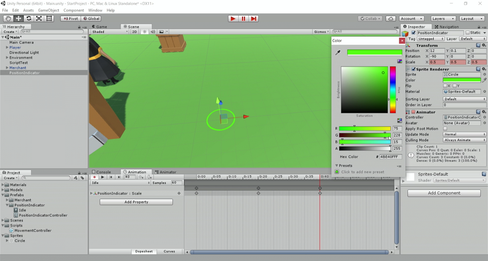

# Unity Navigation - Part 2

In this [episode](https://channel9.msdn.com/Shows/dotGAME/Unity-Navigation-Part-2), we will add the finishing touches to the point and click style movement. We will use [NavMesh Obstacles](https://docs.unity3d.com/Manual/class-NavMeshObstacle.html) to define areas that our character should not walk through, such as the well. We'll also show the player where they clicked by animating a simple sprite, instantiating copies of it every time the player clicks and then destroying it once the animation is complete.

Where is the starter project?

This episode is part of a series. You can use the "Finished Project" from the [Unity Navigation Part 1](../UnityNavigationPt1) episode as the starting project.

# Resources

* NavMesh Obstacle [Manual](https://docs.unity3d.com/Manual/class-NavMeshObstacle.html) and [Scripting API](https://docs.unity3d.com/ScriptReference/AI.NavMeshObstacle.html)
* [Sprites](https://docs.unity3d.com/Manual/Sprites.html)
* [Animator Component](https://docs.unity3d.com/Manual/class-Animator.html)
* [Animator Controller](https://docs.unity3d.com/Manual/class-AnimatorController.html)

# Credit

This project uses the following assets:

* [Low Poly: Free Pack](https://www.assetstore.unity3d.com/en/#!/content/58821) by AxeyWorks
