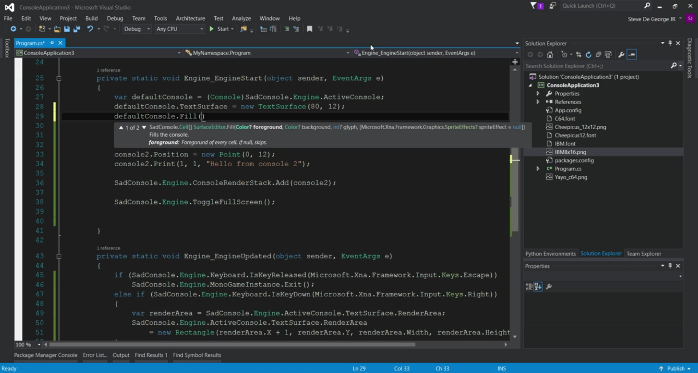

# Getting Started with SadConsole

In this [episode](https://channel9.msdn.com/Shows/dotGAME/Getting-Started-with-SadConsole), Andy De George joins us to talk about SadConsole. SadConsole is a MonoGame 3.5-based game library (using .NET 4.5) that provides an engine to emulate old-school console and command prompt style graphics. To start, we will look at how you get up and running within minutes. Then we'll explore some of the basic functionality and principles such as working with multiple consoles, altering the text color and interact with inputs. 

# Resources

* [SadConsole GitHub Repo](https://github.com/Thraka/SadConsole)
* [SadConsole Editor GitHub Repo](https://github.com/Thraka/SadConsoleEditor/)
* [SadConsole SubReddit](www.reddit.com/r/sadconsole)
