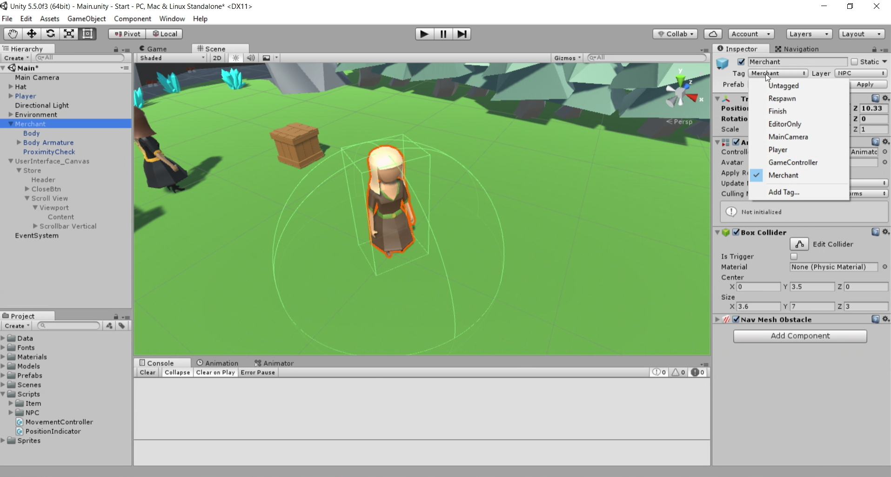

# Inventory and Store System - Part 4.1 (Wiring up the UI)

In this [episode](https://channel9.msdn.com/Shows/dotGAME/Inventory-and-Store-System-Part-41-Wiring-up-the-UI), we will continue our project by hooking up basic mechanics to the store UI. We'll cover the concept of coroutines, as we incorporate logic for showing the dialog. We will also create an inventory database for our merchant which sets the stage for the next part of the series: populating the data.

# Where is the starter project?
This is part of a series. You can use the "Finished Project" from the [Inventory and Store System - Part 3](../UnityItemSystemPt3-UI) episode as the starting project.

# Challenge
There is no challenge for this episode as it will be included at the end of the next episode.

# Resources

* [Coroutines](https://docs.unity3d.com/Manual/Coroutines.html)

# Credit

This project uses the following assets:

* [Low Poly: Free Pack](https://www.assetstore.unity3d.com/en/#!/content/58821) by AxeyWorks
* [Roboto](https://fonts.google.com/specimen/Roboto) and [Mogra](https://fonts.google.com/specimen/Mogra) Fonts
* [UI Pack: RPG Expansion](http://kenney.nl/assets/ui-pack-rpg-expansion) by Kenney
