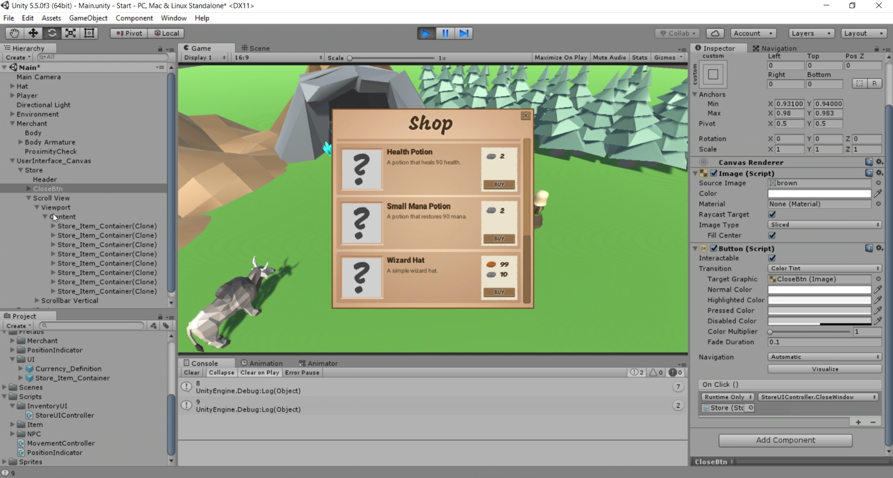

# Inventory and Store System - Part 4.2 (Populating the Data)

In this episode, we are going to wrap up the Store UI in our RPG project. We will focus on populating the data that we've setup with scriptable objects, using various techniques that we have gone over in previous episodes. We'll also tackle some common problems such as clearing out the data from the UI, locking player movement and adding an OnClick event to a button to close the UI.

# Where is the starter project?
This is part of a series. You can use the "Finished Project" from the [Inventory and Store System - Part 4.1](../UnityItemSystemPt4.1-WiringTheUI) episode as the starting project.

# Challenge
There are [two challenges](https://channel9.msdn.com/Shows/dotGAME/Inventory-and-Store-System-Part-42-Populating-the-Data/player#time=24m58s:paused) for this episode. They are:

1. Clear out the existing Store_Item_Template child gameObjects from the Scroll View's content gameObject before populating the data.
2. Hook the `StopStoreUICoroutine` method up to the right place in our game logic so that the Store UI window is no longer called when the player aborts moving to the merchant. 

# Resources

* [Buttons](https://docs.unity3d.com/Manual/script-Button.html)

# Credit

This project uses the following assets:

* [Low Poly: Free Pack](https://www.assetstore.unity3d.com/en/#!/content/58821) by AxeyWorks
* [Roboto](https://fonts.google.com/specimen/Roboto) and [Mogra](https://fonts.google.com/specimen/Mogra) Fonts
* [UI Pack: RPG Expansion](http://kenney.nl/assets/ui-pack-rpg-expansion) by Kenney
