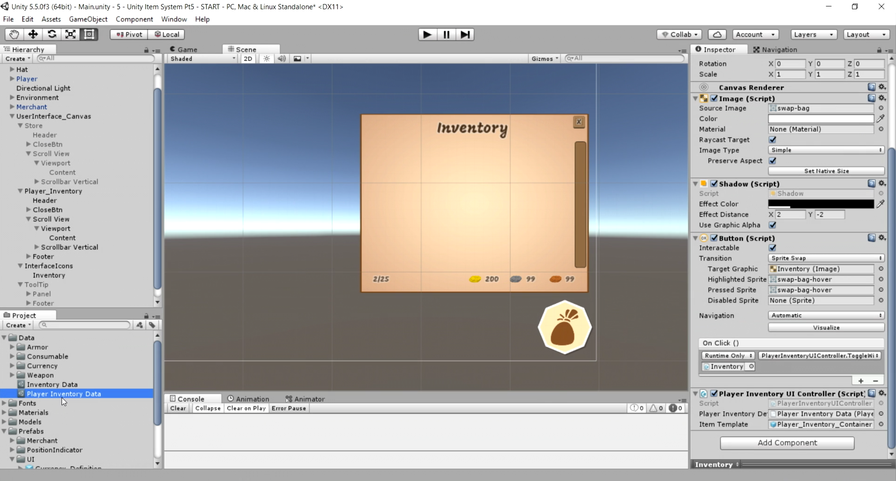

# Inventory and Store System - Part 5.1 (Creating the Player Inventory)

In this [episode](https://channel9.msdn.com/Shows/dotGAME/Inventory-and-Store-System-Part-51-Creating-the-Player-Inventory), we are going to create the player's inventory by tying together many of the concepts that we've learned. To start, we'll talk more in depth about the event system as we add interactivity to the UI. From there, we'll use scriptable objects to define the backend data structure for our player's inventory. We'll wrap up by displaying the player's currency and bag space on the UI. 

Note: This project includes a minor refactoring. `Inventory` was renamed to `MerchantInventoryDetails`.

# Where is the starter project?
This is part of a series. You can use the "Finished Project" from the [Inventory and Store System - Part 4.2](../../3-2017/UnityItemSystemPt4.2-PopulatingUIData) episode as the starting project.

# Challenge
There's no challenge for this episode. The challenge will be at the end of part 5.2.

# Resources

* [Event System](https://docs.unity3d.com/Manual/EventSystem.html)
* [Grid Layout Group](https://docs.unity3d.com/Manual/script-GridLayoutGroup.html)

# Credit

This project uses the following assets:

* [Low Poly: Free Pack](https://www.assetstore.unity3d.com/en/#!/content/58821) by AxeyWorks
* [Roboto](https://fonts.google.com/specimen/Roboto) and [Mogra](https://fonts.google.com/specimen/Mogra) Fonts
* [UI Pack: RPG Expansion](http://kenney.nl/assets/ui-pack-rpg-expansion) by Kenney
* [UI Icons](game-icons.net) from Game-icons.net