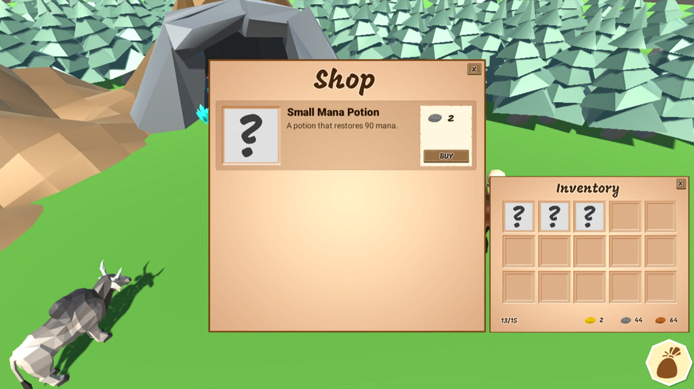

# Inventory and Store System - Part 5.2 (Finishing the Inventory & Buying Equipment)

In this [episode](https://channel9.msdn.com/Shows/dotGAME/Inventory-and-Store-System-Part-52-Creating-the-Player-Inventory) we are going to pick up where we left off by wrapping up the logic for displaying items in the players inventory. First, we will fill up the inventory slots with existing items that the player has, then we will populate their currency. After that, we'll make it so that the player can buy items from the merchant by hooking up an onClick event via code.

# Where is the starter project?
This is part of a series. You can use the "Finished Project" from the [Inventory and Store System - Part 5.1](../UnityItemSystemPt5.1-PlayerInventory) episode as the starting project.

# Challenge
There's no challenge for this episode. The challenge will be at the end of part 5.2.

# Resources

* [Event System](https://docs.unity3d.com/Manual/EventSystem.html)
* [Button.onClick](https://docs.unity3d.com/ScriptReference/UI.Button-onClick.html)

# Credit

This project uses the following assets:

* [Low Poly: Free Pack](https://www.assetstore.unity3d.com/en/#!/content/58821) by AxeyWorks
* [Roboto](https://fonts.google.com/specimen/Roboto) and [Mogra](https://fonts.google.com/specimen/Mogra) Fonts
* [UI Pack: RPG Expansion](http://kenney.nl/assets/ui-pack-rpg-expansion) by Kenney
* [UI Icons](game-icons.net) from Game-icons.net
