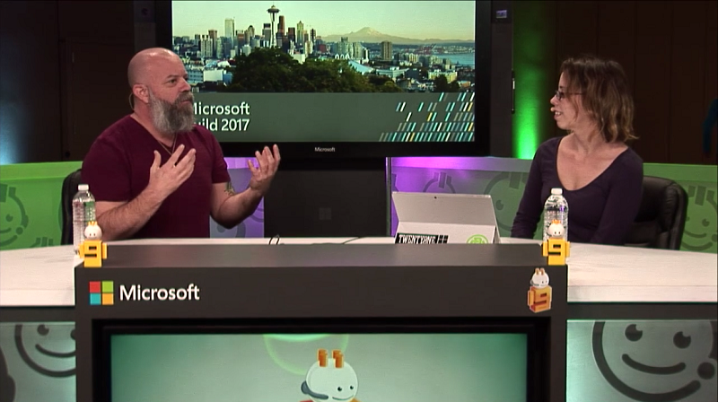

# Build 2017 - Xbox Live, Creators Program and more

In this [episode](https://channel9.msdn.com/Shows/dotGAME/Build-2017-Xbox-Live-Creators-Program-and-more), Andrew Parsons joins the show to talk about Xbox Live, Creators program, Game Mode, building UWP games and developing for Xbox.

# Resources

* [Creators Program](https://channel9.msdn.com/Shows/dotGAME/aka.ms/xblcp)
* [ID@Xbox](http://www.xbox.com/en-US/developers/id)
* [Xbox One Developer Mode activation](https://docs.microsoft.com/en-us/windows/uwp/xbox-apps/devkit-activation)
* [Game Mode](https://support.xbox.com/en-US/games/game-setup/use-game-mode-gaming-on-pc)

