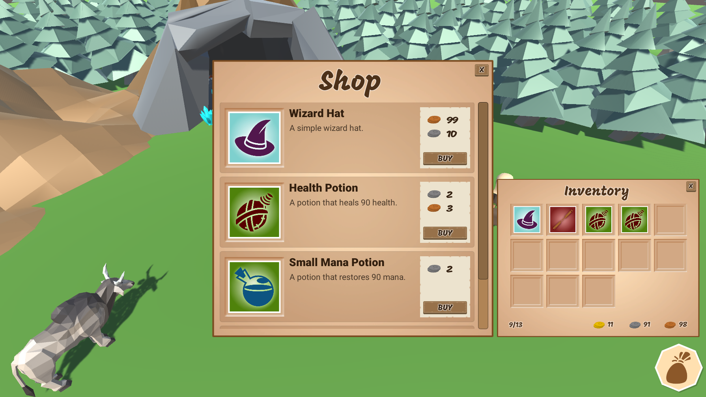

# Inventory and Store System - Part 5.3 (Hooking into Event System Events via Code)

In this [episode](https://channel9.msdn.com/Shows/dotGAME/Inventory-and-Store-System-Part-53-Hooking-into-Event-System-Events), we are going to go over the challenge given at the end of Part 5.2 by adding logic to sell or destroy items in our inventory. The action taken will depend on game logic such as whether the store window is open and what mouse button the player pushed. We will explore more of the event system by looking at how you can access events in code, particularly the OnPointerClick event. 

# Where is the starter project?
This is part of a series. You can use the "Finished Project" from the [Inventory and Store System - Part 5.2](../../4-2017/UnityItemSystemPt5.2-PlayerInventory) episode as the starting project.

# Challenge
There's no challenge for this episode.

# Resources

* [Event System](https://docs.unity3d.com/Manual/EventSystem.html)
* [PointerEventData](https://docs.unity3d.com/ScriptReference/EventSystems.PointerEventData.html)
* [IPointerClickHandler](https://docs.unity3d.com/ScriptReference/EventSystems.IPointerClickHandler.html)

# Credit

This project uses the following assets:

* [Low Poly: Free Pack](https://www.assetstore.unity3d.com/en/#!/content/58821) by AxeyWorks
* [Roboto](https://fonts.google.com/specimen/Roboto) and [Mogra](https://fonts.google.com/specimen/Mogra) Fonts
* [UI Pack: RPG Expansion](http://kenney.nl/assets/ui-pack-rpg-expansion) by Kenney
* [UI Icons](game-icons.net) from Game-icons.net
