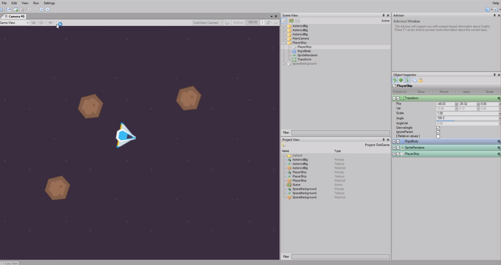

# Getting started with Duality - Part 1

In this [episode](https://channel9.msdn.com/Shows/dotGAME/Getting-Started-with-Duality--Part-1), [Fedja Adam](https://twitter.com/Adams_Lair) joins us to talk about Duality. Duality is an open-source modular 2D game engine that provides its own visual editor. It's plugin based and written entirely in C#, making it highly extensible. To start, we will look at how you get up and running within minutes. Then we'll explore some of the basic principles such as navigating the UI, adding sprites, working with physics and finally accepting input and applying that to movement. 

# Resources

* [Duality Website](http://duality.adamslair.net/)
* [Duality on GitHub](https://github.com/AdamsLair/duality)

# Credit

This project uses the following assets:

* [Space Shooter Redux ](http://kenney.nl/assets/space-shooter-redux) by Kenney