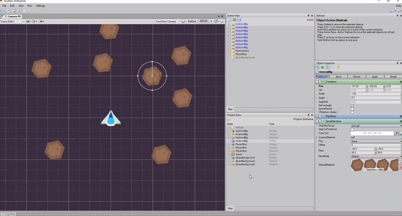

# Getting started with Duality - Part 2

In this [episode](https://channel9.msdn.com/Shows/dotGAME/Getting-Started-with-Duality--Part-2) Fedja Adam, the creator of Duality, continues to walk us through basic principles of the engine. This episode will mainly focus on working with prefabs and walk through some more scripting principles. From the game logic side, we'll add code so that the camera will follow the player ship while it moves and add the ability to shoot lasers.  Duality is an open-source modular 2D game engine that provides its own visual editor. Its plugin based and written entirely in C#, making it highly extensible.

# Resources

* [Duality Website](http://duality.adamslair.net/)
* [Duality on GitHub](https://github.com/AdamsLair/duality)

# Credit

This project uses the following assets:

* [Space Shooter Redux ](http://kenney.nl/assets/space-shooter-redux) by Kenney